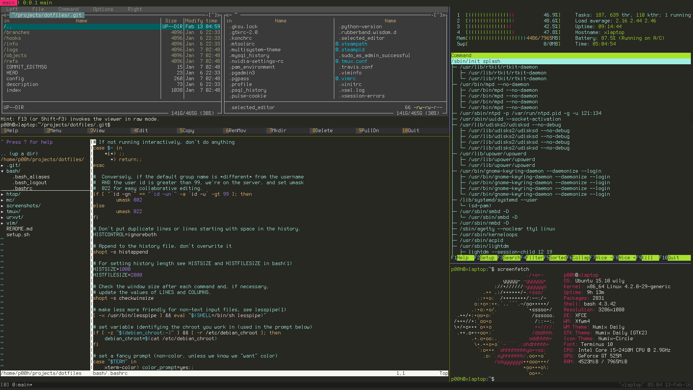

# Dotfiles

## What's included

- Bash settings, aliases and useful scripts

- Htop configuration

- MC file-manager configuration

- Tmux configuration

- Urxvt terminal configuration

- Vim configuration

## Screenshot

