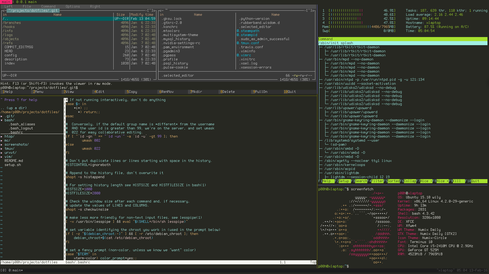

# Dotfiles
## Project information
This is my dotfiles project. There are many like it, but this one is mine.

## What's included
- [zsh](http://www.zsh.org/)(shell) configuration with [oh-my-zsh](https://raw.github.com/robbyrussell/oh-my-zsh/master/tools/install.sh)
- [uv](https://github.com/astral-sh/uv)(python package and version manager) auto setup + pre-installed packages
- [nvm](https://github.com/nvm-sh/nvm)(nodeJS version manager) auto setup with plugins
- [tmux](https://tmux.github.io/)(terminal multiplexer) configuration with [tpm](https://github.com/tmux-plugins/tpm) plugin manager
- [nano configuration](https://github.com/scopatz/nanorc)

## Installation
Just run:
```bash
bash -c "`curl -fsSL https://raw.githubusercontent.com/ip0000h/dotfiles/master/install.sh`"
```

## Screenshot

