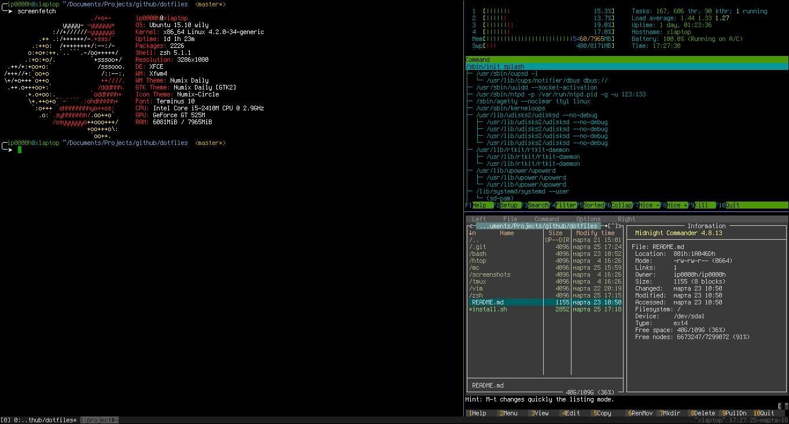

# Dotfiles
## Project information
My examples of configuration files for console applications with installation script.

## What's included
- shell script for automatic install
- [bash](https://www.gnu.org/software/bash/)(shell) configuration, aliases and useful scripts
- [zsh](http://www.zsh.org/)(shell) configuration with [oh-my-zsh](https://raw.github.com/robbyrussell/oh-my-zsh/master/tools/install.sh)
- [htop](http://hisham.hm/htop/)(interactive process viewer) configuration
- [mc](https://www.midnight-commander.org/)(file manager) configuration
- [pyenv](https://github.com/yyuu/pyenv)(python version manager) configuration
- [tmux](https://tmux.github.io/)(terminal multiplexer) configuration with [tpm](https://github.com/tmux-plugins/tpm) plugin manager
- [vim](http://www.vim.org/)(text editor) configuration

## Installation
Just run ./install.sh script.

## Screenshot

